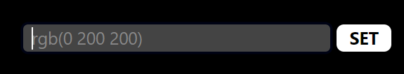

# Color Translator and Picker

This website allows one to translate, pick, and tune a color among multiple color formats, following the W3C standards.

This is a visual interface of the [color-translate](https://github.com/jeronimoek/color-translate) library

[Visual Studio Code Extension](https://github.com/jeronimoek/color-picker-universal)

## How To Use

These are the functionalities of this web:

### Color String Input

This field takes a color string input in any valid format and sets it as the current color.

### Color Preview

This previews the current color and compares it to pure black and white.

### Color Tuning

There is a color slider for each property, for each color format.
This slider allows tuning the color as required.

There is also a `play` button, which constantly changes the given color property, allowing you to see how it affects every other property, and the color preview.
